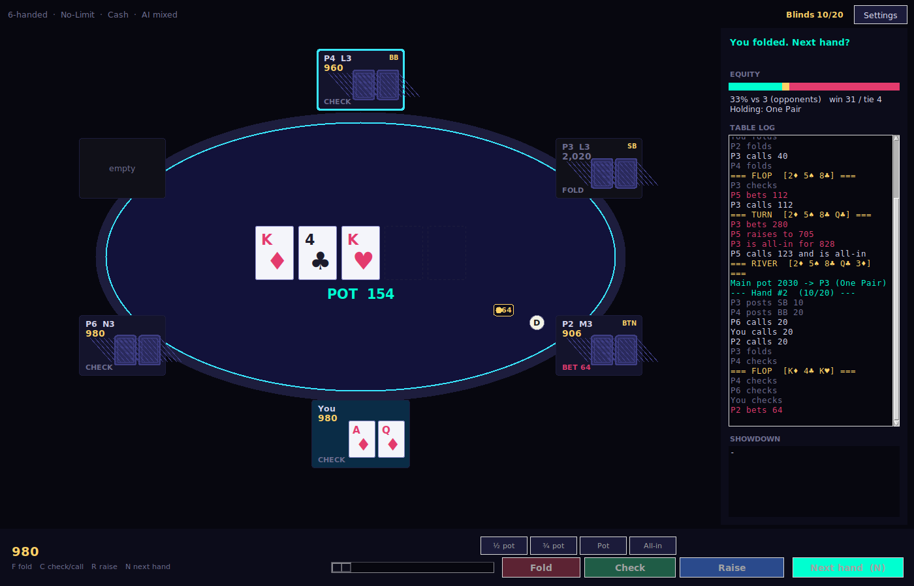

# Texas Hold'em

[](https://github.com/nephrium83/texas-holdem/actions/workflows/ci.yml)

Texas Hold'em for the desktop: a Tkinter table on top of a headless,
heavily tested game engine. No dependencies beyond the Python standard
library.



## Features

- **Real betting rounds** — raises re-open action, the big blind gets its
  option, position is enforced (UTG through button, heads-up handled
  correctly), and the all-in under-raise rule is implemented: a short
  all-in re-opens calls but not raises until a full raise follows.
- **Three structures** — No-Limit, Pot-Limit, and Fixed-Limit with the
  four-raise cap.
- **Correct settlement** — layered side pots, uncalled-bet refunds, and
  odd chips awarded left of the button.
- **Opponents that play back** — four styles (Nit, Solid, Loose, Maniac)
  across three skill levels. Decisions come from Chen-formula preflop
  ranges with position and short-stack push/fold, and postflop Monte
  Carlo equity weighed against pot odds: value bets, continuation bets,
  semi-bluffs, and bluffs. Lower-skill opponents misread their own
  equity rather than just folding more.
- **Fast evaluator** — bitmask 5/6/7-card evaluation, roughly 26x faster
  than a dict-based subset scan, verified against an independent
  brute-force oracle.
- **Responsive UI** — live equity runs on a background thread and stale
  results are discarded; the table never blocks on math.
- **Real table procedure** — the dead-button rule (busted blinds never
  let anyone skip a post), sit-out with owed blinds on return (post now
  or wait for the big blind), an action clock with a time bank that
  tops up each orbit, and showdown order with mucking: the river
  aggressor shows first, beaten hands muck, and all-in hands are always
  tabled.
- **Modern extras** — big blind ante and clock-based blind levels in
  tournaments, run it twice on all-in pots (ask, always, or never),
  UTG straddles in big-bet cash games, rabbit hunting, and cash-game
  table stakes: 40-100 BB buy-ins with top-ups and auto-rebuying
  opponents.
- **Table options** — 2 to 9 seats, cash or tournament blinds, bet
  slider with pot-fraction presets, coaching hints, live equity bar,
  winner highlighting, two themes, adjustable speed, and F/C/R/N
  hotkeys.

## Requirements

Python 3.10+ with Tk (bundled with the standard python.org installers).

## Run

From a clone:

```
python -m holdem
```

Or install it:

```
pip install .
holdem
```

## Architecture

```
holdem/
  engine.py   game state, betting legality, settlement, evaluator, AI
  gui.py      Tkinter table, canvas rendering, threaded equity
```

`engine.py` never imports tkinter. Everything that decides who may act,
for how much, and who wins is plain Python that runs headless — which is
what makes the test suite below possible.

## Testing

```
pytest            # engine suite
python tests/gui_smoke.py   # boots the real UI (needs a display)
```

The suite cross-checks the evaluator against a brute-force reference on
20,000 random 7-card deals, pins known hands and Chen scores, verifies
side-pot amounts, eligibility, and refunds on a deterministic three-way
all-in, and includes regression tests for the under-raise rule, the
dead-button rule under busts, big-blind-ante accounting (including the
orphaned-ante side-pot case), straddle option order, run-it-twice pot
splitting, showdown order and mucking, and owed blinds across sit-outs.
A fuzz pass plays full games across every structure and seat count
asserting three invariants: chips are conserved, no illegal action is
ever taken, and every betting round closes with all live bets matched. CI runs the
engine suite on Python 3.10/3.12/3.13 and boots the GUI under Xvfb to
play 15 hands headless.

## License

MIT
