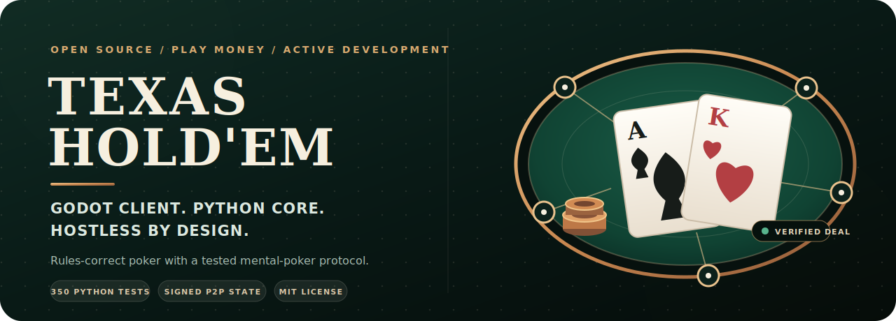
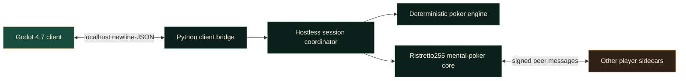

<p align="center">
  
</p>

<p align="center">
  <a href="https://github.com/nephrium83/texas-holdem/actions/workflows/ci.yml"></a>
  
  
  
  <a href="LICENSE"></a>
</p>

<p align="center">
  <strong>A rules-correct Texas Hold'em engine evolving into a serverless Godot experience.</strong><br>
  Godot renders the table. Python owns the rules. Every peer verifies the deal.
</p>

---

## Why this project

Texas Hold'em is a play-money desktop poker project built around a deterministic
Python engine and a hostless mental-poker protocol. Instead of moving poker
logic into the UI or trusting one machine to deal, the architecture gives every
peer the same rules engine, signed state transitions, and cryptographically
verifiable deal inputs.

The current playable harness is Tkinter. The target client is Godot 4.7.1,
connected to the Python sidecar through a locked newline-JSON protocol.

<table>
  <tr>
    <td width="50%">
      <strong>Rules before rendering</strong><br>
      Betting legality, position, side pots, refunds, showdown order, and
      settlement live in one headless engine.
    </td>
    <td width="50%">
      <strong>No trusted dealer</strong><br>
      Ristretto255 threshold ElGamal, DLEQ proofs, shuffle auditing, and
      post-hand verification power the mental-poker core.
    </td>
  </tr>
  <tr>
    <td width="50%">
      <strong>Hostless continuous play</strong><br>
      Stack carry, dead-button rotation, eliminations, heads-up transitions,
      void-and-redeal, and final winner delivery run on every peer.
    </td>
    <td width="50%">
      <strong>Built to be tested</strong><br>
      350 Python tests, a 15-hand GUI smoke run, and Godot GUT execute in CI
      across Python 3.10, 3.12, and 3.13.
    </td>
  </tr>
</table>

## Project status

| Layer | Status | What that means |
| --- | --- | --- |
| Poker rules engine | Implemented | No-Limit, Pot-Limit, Fixed-Limit, side pots, refunds, odd chips, tournament and cash procedures |
| Mental-poker core | Implemented and tested | Distributed key ceremony, shuffle chain, selective decryption, audit, and cheat detection |
| Hostless session | Implemented on the test transport | Signed betting, continuous hands, stack carry, bust-outs, spectators, and table-wide voids |
| Godot sidecar bridge | Implemented | Versioned snapshots and commands over localhost newline-JSON |
| Godot player experience | In progress | Godot 4.7.1 scaffold and GUT harness are in CI; the playable table is the current milestone |
| Internet P2P transport | Planned for v1.x | Discovery, relay/NAT traversal, fragmentation, and real multi-machine play remain |

> [!IMPORTANT]
> This is an experimental, play-money project. The cryptographic protocol has
> extensive automated coverage but has not received an independent security
> audit. It is not intended for wagering, custody, or real-money play.

## Architecture



The client is intentionally thin. It renders snapshots and sends commands; it
does not recalculate legal actions, pots, winners, or card state. See the
[Godot-sidecar protocol](docs/GODOT_PROTOCOL.md) for the versioned contract.

## Poker engine

- No-Limit, Pot-Limit, and Fixed-Limit betting with correct raise reopening.
- Two to nine seats, including correct heads-up position and action order.
- Layered side pots, uncalled-bet refunds, and odd chips left of the button.
- Dead-button movement, owed blinds, sit-out/return, straddles, and big-blind ante.
- Run it twice, rabbit hunting, showdown order, mucking, and all-in tabling.
- Cash buy-in rules, top-ups, auto-rebuy, tournament levels, clocks, and time banks.
- Four AI styles across three skill levels with range, equity, and pot-odds decisions.

## Trustless deal

The mental-poker path is peer-symmetric: every active seat participates in the
key ceremony, shuffle, selective decryption, betting replica, and post-hand
audit. A detected cheat or state divergence fails the hand closed for the
entire table rather than allowing peers to continue on conflicting state.

Implemented building blocks include:

- Ristretto255 group operations backed by libsodium.
- Threshold ElGamal encryption and re-encryption.
- Schnorr proof-of-possession for key shares.
- DLEQ-proven partial decryptions.
- Optional cut-and-choose shuffle prevention plus mandatory post-hand audit.
- Signed hostless wire messages and hand-scoped buffering.

The real internet transport is deliberately separate from the protocol core.
Today, multi-peer sessions are exercised through an in-memory transport; the
libp2p/relay path and physical-machine playtest remain v1.x gate work.

## Run the current playable harness

```bash
git clone https://github.com/nephrium83/texas-holdem.git
cd texas-holdem
python -m venv .venv
python -m pip install -e .
python -m holdem
```

Python 3.10 or newer is required. Tk is required for the legacy harness and is
included with standard python.org Windows installers.

<details>
  <summary><strong>View the legacy Tkinter player interface</strong></summary>
  <br>
  <p align="center">
    
  </p>
  <p>
    This interface remains useful as a playable engine harness, but it is not
    the target visual experience. The shipping client is being rebuilt in Godot.
  </p>
</details>

## Test the project

```bash
python -m pip install -e . pytest
python -m pytest -q
python tests/gui_smoke.py
godot --headless --path godot -s addons/gut/gut_cmdln.gd -gdir=res://test/unit -gexit
```

| CI job | Coverage |
| --- | --- |
| Python 3.10 / 3.12 / 3.13 | Engine, evaluator, settings, P2P crypto, session, transport, and sidecar tests |
| GUI smoke | Boots the Tk harness headlessly and plays 15 hands |
| Godot 4.7.1 | Runs the checked-in GUT suite headlessly |

The crypto tests require a libsodium build exposing the Ristretto255 API. See
[native/README.md](native/README.md) for discovery rules and build instructions.

## Roadmap

- [x] Rules-complete deterministic Python engine.
- [x] Mental-poker key ceremony, shuffle, deal, and audit.
- [x] Hostless betting replicas and continuous multi-hand sessions.
- [x] Godot-sidecar protocol, socket bridge, scaffold, and CI.
- [ ] Playable Godot client MVP.
- [ ] Silent-peer timeout that triggers the existing table-wide void path.
- [ ] Real libp2p transport and proof fragmentation.
- [ ] Two-machine join-code playtest.

The hard gate and deferred work are tracked in
[L5_SCOPE.md](docs/L5_SCOPE.md). The full protocol and transport rationale live
in [MULTIPLAYER.md](docs/MULTIPLAYER.md).

## Repository map

```text
holdem/
  engine.py              authoritative rules, betting, settlement, evaluator
  client_view.py         private/public snapshot boundary
  client_server.py       localhost bridge consumed by Godot
  p2p/                   crypto, mental deal, replicated session, transports
godot/
  project.godot          Godot 4.7 client project
  test/unit/             GUT client tests
docs/
  GODOT_PROTOCOL.md      versioned client-sidecar contract
  L5_SCOPE.md            implementation gate and current roadmap
  MULTIPLAYER.md         serverless protocol and transport design
```

## License

Released under the [MIT License](LICENSE).
